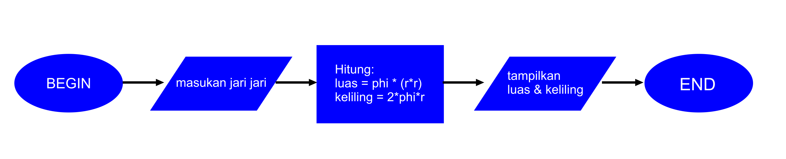

## **Program menghitung luas keliling lingkaran**

### Rumus Luas & Keliling Lingkaran
```sh
Luas     = π × r²
Keliling = 2 x π × r
```
- Nilai Phi yang akan digunakan adalah 3.14
- r merupakan jari-jari lingkaran

Phi merupakan nilai konstanta di matematika sementara jari-jari merupakan jarak antara titik pusat dengan tepi lingkaran. Sebetulnya ada rumus lain untuk menghitung keliling lingkaran yaitu dengan menggunakan diameter, tapi pada kasus ini kita cukup menggunakan jari jari lingkaran saja.


**Float** adalah tipe data yang menampung bilang desimal/pecahan.

## **FLOWCART**



## **OUTPUT**


